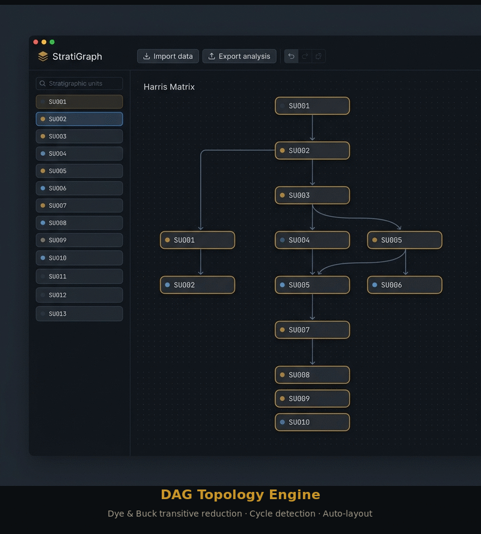

<div align="center">
  
  <h1>StratiGraph</h1>
  <p><strong>A Modern, AI-Ready Harris Matrix Generator & Digital Heritage Hub</strong></p>
  <p>
    
    
    
    
    
  </p>
  <p>
    <a href="https://github.com/mabo-du/stratigraph/releases/latest"><strong>⬇ Download StratiGraph</strong></a>
  </p>
</div>

---

<div align="center">
  
  <br>
  <sub>Feature tour: DAG engine · Finds heatmap · Publication mode · CSV import · Dark/Light themes · Ecosystem</sub>
</div>

StratiGraph is an open-source, cross-platform desktop application for archaeologists to visually construct, validate, and export Harris Matrices — the directed acyclic graphs used to model stratigraphic relationships in every excavation. It runs entirely offline with zero backend dependency, keeping your field data private and secure.

**Downloads available for Linux (.deb), macOS (.dmg), and Windows (.exe) — see the [latest release](https://github.com/mabo-du/stratigraph/releases/latest).**

## Key Features

### DAG Topology Engine
Construct massive matrices with confidence. The engine uses the **Dye & Buck (1987) algorithm** for automatic transitive reduction, pruning mathematically redundant relationships to produce valid, physically sound stratigraphic directed acyclic graphs. Cycle detection via DFS runs on every relationship addition.

### Digital Heritage Ecosystem Integration
StratiGraph is the central hub of an open-source digital heritage workflow, interoperating with every phase of the post-excavation pipeline:

| Project | Role | StratiGraph Integration |
|---------|------|------------------------|
| **HOARD** | AI context-sheet digitisation (Phases 0-5) | Imports Phase 1 `ctx_sheet_*.json` files. Exports EEDP paths for hallucination-free AI report generation. |
| **Trowel** | Compliance report drafting from field data | Bi-directional: Trowel consumes EEDP exports for deterministic stratigraphic narrative generation. |
| **Libby** | Bayesian radiocarbon calibration | Exports `OxCal CQL` scripts with transitively reduced stratigraphic constraints for MCMC modelling. |
| **Dibble** | 3D lithic morphological analysis | Shares the broader vision of connected digital heritage tools. |

### Premium UI & Data Visualization
*   **Publication Mode:** Disable auto-layout and freely drag, nudge, and lock nodes into pixel-perfect alignment for final PDF publication.
*   **Finds Density Heatmap:** Switch from sequence mode to heatmap mode — the matrix recolours itself based on find/event density per context.
*   **Dark Mode:** A seamlessly integrated Dark Mode cascading into the Cytoscape canvas itself.
*   **Timeline Mode:** Toggle a vertical time axis that projects calibrated C14 dates onto the DAG. Each context's Y position is set from its median cal BP — older contexts at the bottom, younger at the top. The left edge shows a cal BP/BC/AD scale with horizontal gridlines, and phase-coloured bands provide chronological context. Click again to restore the dagre auto-layout.
*   **CSV Import:** Upload `contexts.csv` and `relationships.csv` files with a visual column mapper supporting 20+ naming convention variants.

### Real-Time P2P Collaboration
WebRTC-based peer-to-peer sync using Yjs CRDTs with cryptographic identity enforcement via Ed25519 signatures. The native desktop wrapper handles firewall integration (Windows Defender, macOS TCC). Discover peers on your local network via mDNS — no server, no cloud, no sign-up.

### Cross-Platform Desktop
Native installers for Linux, macOS, and Windows built with Tauri v2. The app runs as a self-contained desktop application with native file dialogs, offline storage, and OS-level integration.

## Data Schema (HMDP)

StratiGraph uses the open **Harris Matrix Data Package (HMDP)** schema, ensuring your data is portable and interoperable:

```json
{
  "version": "1.0",
  "meta": { "projectName": "Roman Villa", "crs": "EPSG:4326" },
  "contexts": [
    { 
      "id": "SU001", 
      "type": "Positive", 
      "phase": "P1",
      "spatial": { "centroid": { "x": 500.5, "y": 1000.2, "z": 12.4 } }
    }
  ],
  "observations": [
    { "id": "rel1", "source": "SU001", "target": "SU002", "relationshipType": "Above" }
  ]
}
```

## Tech Stack

*   **React + TypeScript** with Vite
*   **Cytoscape.js & Dagre** for graph rendering and Sugiyama layout
*   **Tauri v2** for native desktop builds (Rust backend, WebView frontend)
*   **Yjs (CRDTs) + WebRTC** for real-time peer-to-peer collaboration
*   **Frictionless Data** for standardised CSV parsing and schema validation

## Install

### Desktop (recommended)
Download the installer for your platform from the [latest release](https://github.com/mabo-du/stratigraph/releases/latest):

| Platform | Format |
|----------|--------|
| Linux | `.deb` package |
| macOS | `.dmg` disk image (Apple Silicon) |
| Windows | `.exe` NSIS installer |

### Web (development)
StratiGraph can also run entirely in your browser with no backend:

```bash
git clone https://github.com/mabo-du/stratigraph.git
cd stratigraph/app
npm install
npm run dev
```

Navigate to `http://localhost:5173`.

### Desktop development
Build and run the Tauri desktop wrapper locally:

```bash
cd app
npm run tauri:dev     # Hot-reload development
npm run tauri:build   # Production build (.deb/.dmg/.exe)
```

## Ecosystem Workflows

### Importing from HOARD
1. Run HOARD Phase 1 to digitise your context sheets → `ctx_sheet_*.json` files
2. In StratiGraph, click **Import** → **HOARD JSON Import**
3. Multi-select all JSON files
4. Review the summary and click **Generate Harris Matrix**
5. Stratigraphic edges are auto-inferred from relationship fields

### Exporting to Libby (Bayesian Modelling)
1. Import or create contexts with radiocarbon events
2. Click **Export** → **Export for Libby (.oxcal)**
3. Load the generated CQL script into OxCal or Libby for MCMC calibration

### Exporting for Publication
* **PNG/SVG/PDF** — Publication-ready exports at 2× resolution
* **GeoJSON** — Contexts with spatial coordinates for GIS/QGIS integration
* **ArchesDB JSON** — CIDOC-CRM compliant heritage inventory format

## License

MIT — see [LICENSE](LICENSE) for details.
