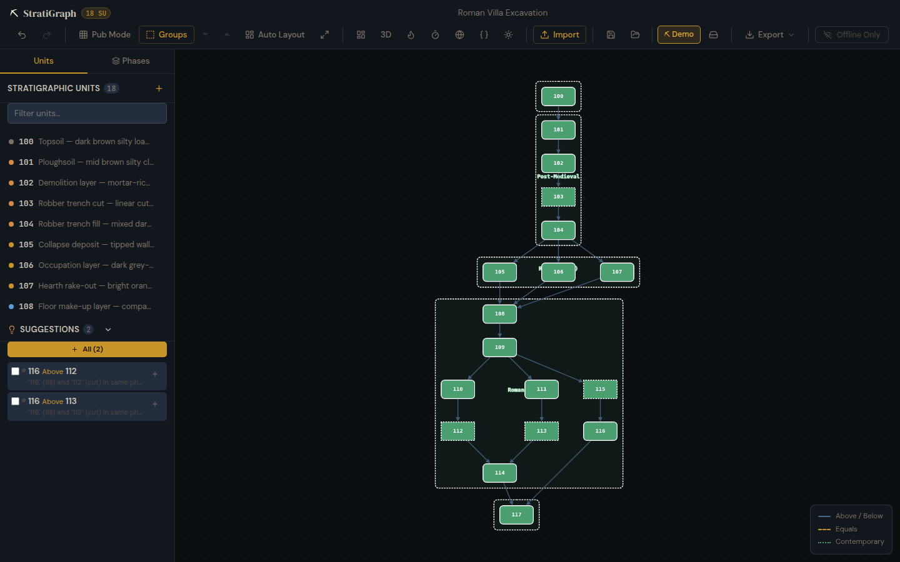
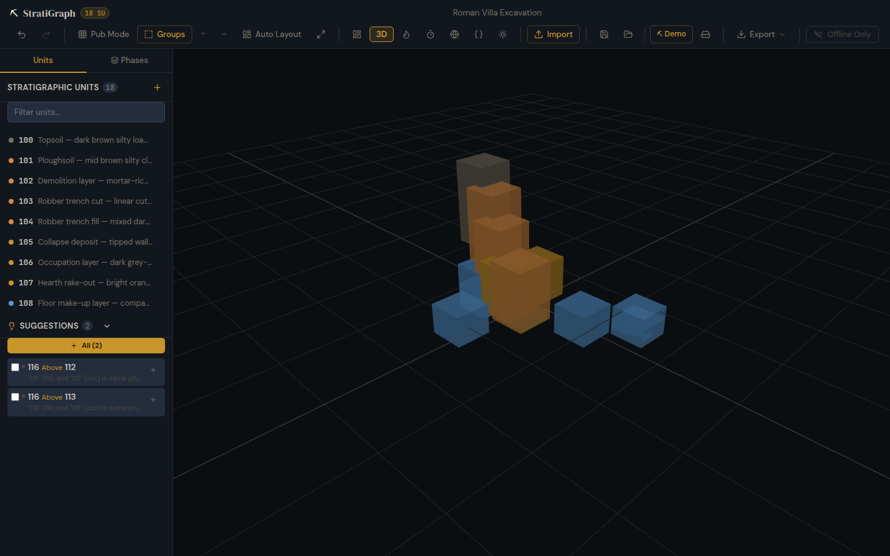
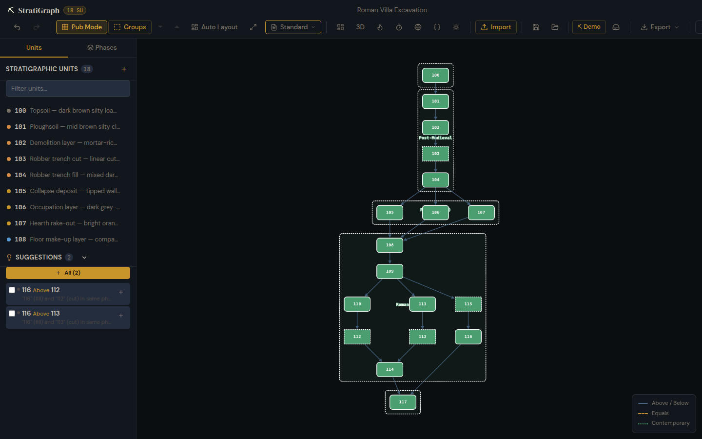
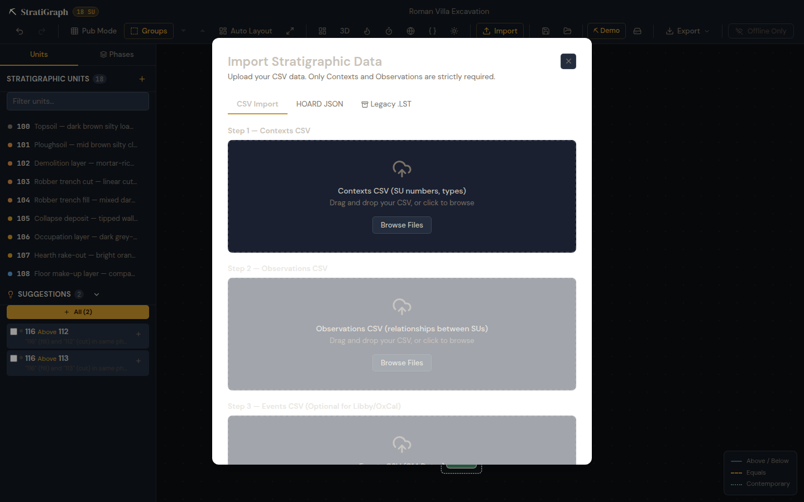
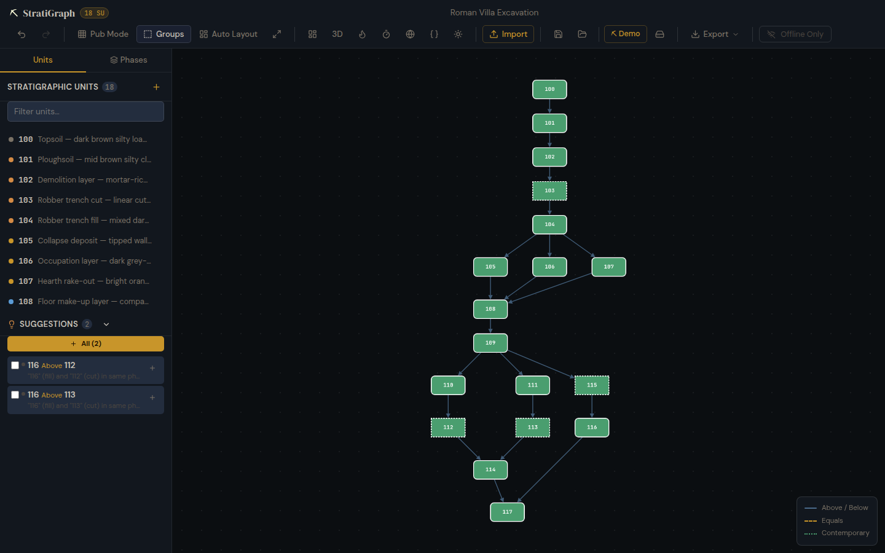

# StratiGraph User Guide

## Getting Started

StratiGraph is a browser-based Harris Matrix generator for archaeological stratigraphy. It runs in your browser or as a desktop application (Linux/macOS/Windows).

### Loading the Demo

Click **⛏ Demo** in the toolbar to load the Roman Villa Excavation example — 18 stratigraphic units with relationships, phases, and radiocarbon dates.



### Creating a New Project

1. Click the project name in the toolbar to rename it
2. Use the **Sidebar** (left panel) to add stratigraphic units:
   - **Units tab**: Add contexts by filling in the ID, type, phase, and description
   - **Phases tab**: Create and colour-code phases
3. Define relationships between units in the sidebar's **Node Editor**

## Toolbar Reference

### Matrix Controls

| Button | Action |
|--------|--------|
| **Undo/Redo** | Step through edit history (Ctrl+Z / Ctrl+Shift+Z) |
| **Pub Mode** | Toggle publication mode — disables auto-layout for manual positioning |
| **Pub Mode → template** | Choose Standard, Traditional (Harris), or Minimal (B&W) styling |
| **Groups** | Toggle phase group bounding boxes around units |
| **⏷/⏶** | Collapse/expand all phase groups |
| **Auto Layout** | Re-run the DAG layout algorithm |
| **Fit View** | Zoom to fit all nodes |
| **Dashboard** | Multi-site project dashboard |
| **3D** | 3D spatial view of georeferenced contexts |



### Visual Modes

| Button | Action |
|--------|--------|
| **Flame** | Heatmap mode — colour nodes by finds/event density |
| **Timer** | Timeline mode — position nodes by calibrated radiocarbon date |
| **Globe** | Paleo-coastline map (GPlates) |
| **Braces** | Semantic graph RAG (CIDOC-CRM SPARQL) |
| **Sun/Moon** | Toggle dark/light theme |



### Import & Export

**Import** supports:
- **CSV**: Upload `contexts.csv` with flexible column mapping
- **HOARD JSON**: Import AI-digitised context sheets

**Export** supports:
- PNG, SVG, PDF — publication-quality exports
- GeoJSON — GIS-compatible spatial data
- OxCal CQL — Bayesian radiocarbon calibration scripts
- HOARD prompt/payload — AI report generation
- Trowel EEDP — compliance report drafting
- ArchesDB JSON — CIDOC-CRM heritage inventory



## Collaboration

StratiGraph supports real-time peer-to-peer collaboration over a local network using Yjs CRDTs. No server, no cloud, no sign-up.

### Starting a Session

1. Click **Collaborate** in the toolbar
2. A WebSocket connection starts to the local relay
3. Click the link icon to **Copy invite link** or show a **QR code**

### Joining a Session

1. Click **Join** next to "Collaborate"
2. Paste the `stratigraph://join/{roomId}#key={key}` link
3. Or scan the QR code with your device camera


### mDNS Discovery

StratiGraph automatically discovers peers on the same local network via mDNS. Connected peers appear as avatars in the toolbar.

## Phase Groups

Toggle **Groups** to show colour-coded phase bounding boxes around units. Click **⏷** to collapse a group into a summary node, or **⏶** to expand all.



## 3D Spatial View

If your contexts have spatial coordinates (`spatial.centroid`), click **3D** to view them in an interactive Three.js scene:
- **Orbit**: Click and drag
- **Zoom**: Scroll wheel
- **Pan**: Right-click and drag
- **Select**: Click a context box to select it in the matrix

Contexts are coloured by phase and positioned by their real-world x/y/z coordinates, using elevation as the vertical axis.

## Keyboard Shortcuts

| Shortcut | Action |
|----------|--------|
| Ctrl+Z | Undo |
| Ctrl+Shift+Z | Redo |
| Ctrl+S | Save project |
| Ctrl+F | Search units |
| Escape | Close modal / deselect |

## Data Format

Projects are stored as `.hmatrix.json` files — the open **Harris Matrix Data Package (HMDP)** format:

```json
{
  "version": "1.0",
  "projectName": "Roman Villa",
  "contexts": [{ "id": "100", "type": "Positive", "phase": "phase-roman" }],
  "observations": [{ "source": "100", "target": "101", "relationshipType": "Above" }],
  "phases": [{ "id": "phase-roman", "name": "Roman", "color": "#5b9bd5" }],
  "positions": { "100": { "x": 100, "y": 50 } }
}
```

This is portable, git-friendly, and interoperable with the HOARD, Trowel, and Libby ecosystem tools.
